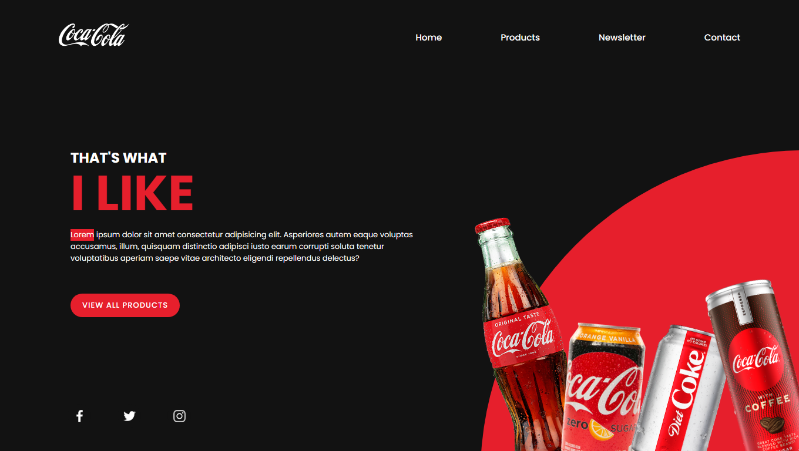

<h1 align="center"> 
    Landing-Page-SASS
</h1>

  <a href="#-About">About</a>&nbsp;&nbsp;&nbsp;|&nbsp;&nbsp;&nbsp;
  <a href="#-Project">Project</a>&nbsp;&nbsp;&nbsp;|&nbsp;&nbsp;&nbsp;
  <a href="#-Technology">Technology</a>

    

<h5 style="text-align: center"> Thank you for see !</h5>

## 📚 Sobre

Olá a todos! Nesse repositório venho mostrar algumas funcionalidade do **SASS**, busquei mostrar códigos úteis utilizados pelo SASS. Em relação ao tema **_Landing Page_** em meio a um projeto feito em **CSS** em um canal do YouTube, procurei transformar o modelo em **SASS**. Com ele podemos ver algumas coisas próprias do **SASS** como: _Nesting_, **_Mixin_**, **_Extends_**, **_Variáveis_**, **_&_** para abreviações entre outros conceito como **_importações_**. Nessa criação pude unir boas tecnologias sendo elas **HTML5** para estruturar todo o projeto e o **SASS** para fazer toda mágica acontecer.

Para ter acesso a conteúdo similares, acesse [DEV envolvente](https://www.youtube.com/@devenvolvente7181)

## 🚀 Technology

O projeto foi desenvolvido a partir das tecnologias:

- *HTML5*
- *SASS*

## 📚 About

Hello everybody! In this repository I come to show some functionality of **SASS**, I tried to show useful codes used by SASS. Regarding the theme **_Landing Page_** in the middle of a project made in **CSS** on a YouTube channel, I tried to transform the model into **SASS**. With it we can see some things typical of **SASS** like: _Nesting_, **_Mixin_**, **_Extends_**, **_Variáveis_**, **_&_** for abbreviations among other concepts like **_importações_* *. In this creation I was able to unite good technologies, namely **HTML5** to structure the entire project and **SASS** to make all the magic happen.

*To access similar content, go to [DEV envolvente](https://www.youtube.com/@devenvolvente7181)*

## 🚀 Technologies Used:

*The project was developed based on technologies:*

- *HTML5*
- *SASS*

--------------

Developed by :atom_symbol: [**Arthur Silva**]([arthursj (ArthurSilva) (github.com)](https://github.com/arthursj))
